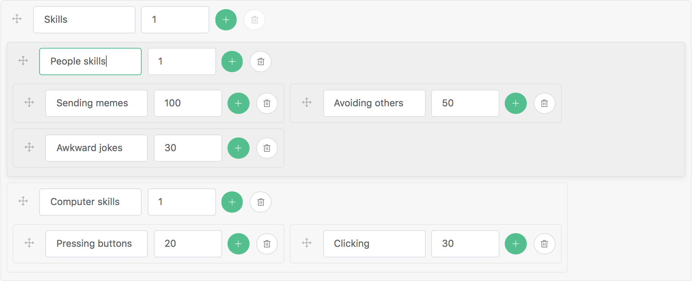

# Tree Data Builder
Build data trees optimized for d3 structure quickly with this app!



<a href="https://tree-data-builder.herokuapp.com" target="_blank">https://tree-data-builder.herokuapp.com</a>

## Project setup
```
npm install
```

### Compiles and hot-reloads for development
```
npm run serve
```

### Compiles and minifies for production
```
npm run build
```

### Run your tests
```
npm run test
```

### Lints and fixes files
```
npm run lint
```

### Customize configuration
See [Configuration Reference](https://cli.vuejs.org/config/).
